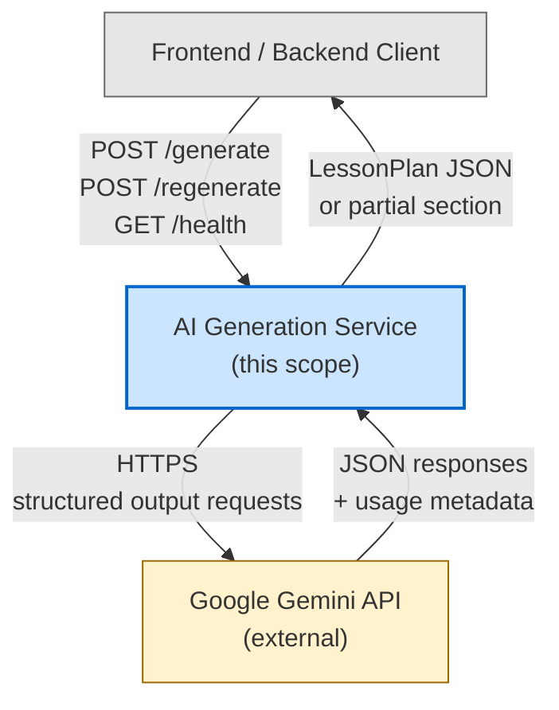
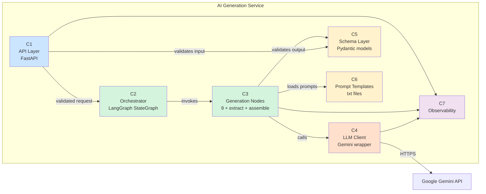
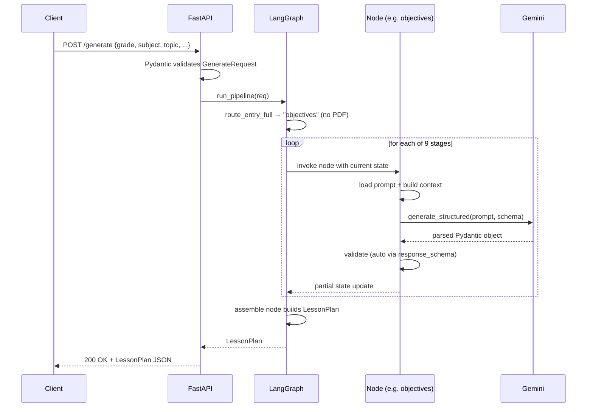
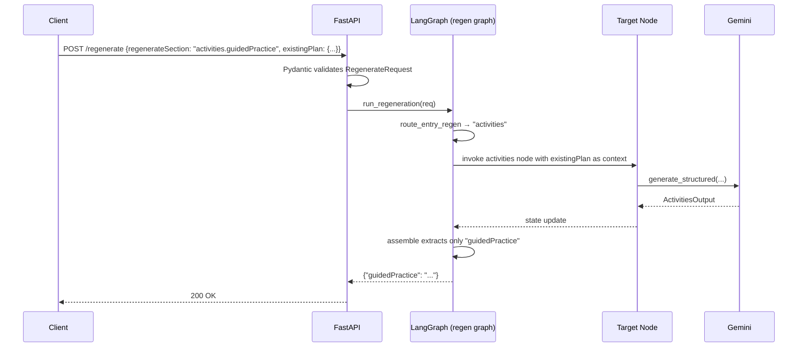

# Architecture Document (HLD + LLD)

**Project:** AI Lesson Planner — AI Generation Layer
**Date:** 5 May 2026
**Status:** Approved for implementation
**Tech Stack:** Python 3.11+, `uv`, FastAPI, LangGraph, Pydantic v2, Google Gemini (`google-genai`), Docker

---

## 1. Document Purpose

This document is the technical blueprint for the AI generation layer. It translates the approved DPR into concrete component structure, module layouts, API contracts, data flows, and failure-handling rules — at a level of detail sufficient for implementation without further design decisions.

### 1.1 Inputs to This Document

| Input | Source |
|---|---|
| Functional and non-functional requirements | `Final_Problem_Statement.md` |
| Architectural choice (Approach 2: LangGraph linear sequential pipeline) | `Solution_Decision_Document.md` |
| Day-by-day execution plan and tech stack | `Detailed_Project_Report.md` |

### 1.2 Document Scope

- **In scope:** component design, data flow, API contracts, error handling, observability, and architectural validation against scalability/maintainability/failure-handling criteria.
- **Out of scope:** prompt-engineering content, individual test cases (covered in DPR §5), and post-MVP Approach-3 architecture (covered in Solution Decision Document §7).

---

## 2. Executive Summary

The system is a stateless Python service exposing three HTTP endpoints (`/generate`, `/regenerate`, `/health`). Internally, generation is orchestrated by a LangGraph `StateGraph` with one node per generation stage. Mode A (topic-only) and Mode B (with chapter PDF text) share the same endpoint; the graph routes itself based on input. Per-section regeneration is a conditional entry into the same graph. Gemini is the only external dependency, used via the `google-genai` SDK with Pydantic models passed as `response_schema` for structured output.

The architecture is deliberately simple — three layers (API, orchestration, generation), no database, no message queue, no cache. This matches the solo-developer / 17-day timeline while leaving a clean upgrade path to Approach 3 (parallel DAG) post-MVP.

---

# PART I — HIGH-LEVEL DESIGN (HLD)

## 3. System Context Diagram



The service is a single deployable unit. There is no database, no internal queue, and no inter-service communication other than the call to Gemini. All state lives inside a single request lifecycle.

---

## 4. Major Components

The system is composed of five logical components, plus configuration. Each maps directly to a Python package in the repository (see LLD §6).

| # | Component | Responsibility | Tech |
|---|---|---|---|
| C1 | **API Layer** | Accept HTTP requests, validate inputs, serialize responses, handle errors | FastAPI + Pydantic |
| C2 | **Pipeline Orchestrator** | Build the StateGraph, route execution, manage shared state | LangGraph |
| C3 | **Generation Nodes** | One node per stage (9 generators + 1 chapter-extraction + 1 assemble) | Python + Gemini |
| C4 | **LLM Client** | Wrap `google-genai`, enforce structured output, retry on validation failure | `google-genai` SDK |
| C5 | **Schema Layer** | Pydantic models for inputs, per-section outputs, and final LessonPlan | Pydantic v2 |
| C6 | **Prompt Templates** | Versioned text files, one per node, loaded at startup | Plain `.txt` files |
| C7 | **Observability** | Structured logging (stdout JSON), per-request and per-node metrics | Python `logging` |

## 5. Component Interactions



### 5.1 Interaction Flow Summary

1. **Request enters API Layer** — FastAPI auto-validates the JSON body against the `GenerateRequest` Pydantic model (Schema Layer). Invalid bodies return HTTP 422 before any business logic runs.
2. **API Layer invokes the Orchestrator** — Hands the validated Pydantic object to `run_pipeline(req)`, which compiles or reuses a cached LangGraph graph.
3. **Orchestrator routes the entry** — Conditional entry edge picks `chapter_extraction` (Mode B) or `objectives` (Mode A) based on whether `chapterPdfText` is present.
4. **Each node executes in turn** — Node loads its prompt template, builds a request, calls the LLM Client, validates the response against its section's Pydantic model, and merges the result into shared state.
5. **`assemble` node finalizes** — Reads the accumulated state and returns either the full `LessonPlan` (full generation) or only the regenerated field (regeneration mode).
6. **Response flows back through API Layer** — Serialized to JSON via the `LessonPlan` response model.

---

## 6. External Dependencies

| Dependency | Used For | Failure Implication |
|---|---|---|
| **Google Gemini API** | All generation calls | Hard dependency. Service cannot generate plans without Gemini. Mitigated by per-node retry, model fallback (`pro` → `flash`), and clear 502/503 errors on persistent failure. |
| **Python runtime** (3.11+) | Service execution | Standard. |
| **`uv` package manager** | Build and dependency resolution | Build-time only — not in runtime image after multi-stage Docker build. |

Notably absent: no database, no Redis, no message broker, no separate auth service. The MVP is intentionally a single self-contained service.

---

# PART II — LOW-LEVEL DESIGN (LLD)

## 7. Repository Structure

```
ai-lesson-planner/
├── pyproject.toml              # uv-managed dependencies
├── uv.lock                     # locked dependency versions (committed)
├── Dockerfile                  # multi-stage build with uv builder
├── .dockerignore
├── .env.example                # documents required env vars
├── README.md
├── docs/
│   ├── Final_Problem_Statement.md
│   ├── Solution_Decision_Document.md
│   ├── Detailed_Project_Report.md
│   └── Architecture_Document.md   # this file
├── app/
│   ├── __init__.py
│   ├── main.py                 # FastAPI app + routes
│   ├── config.py               # Settings loaded from env
│   ├── schemas/
│   │   ├── __init__.py
│   │   ├── inputs.py           # GenerateRequest, RegenerateRequest
│   │   ├── outputs.py          # LessonPlan (final assembled)
│   │   └── sections.py         # ObjectivesOutput, ActivitiesOutput, etc.
│   ├── llm/
│   │   ├── __init__.py
│   │   ├── client.py           # GeminiClient wrapper
│   │   └── retry.py            # validate_and_retry helper
│   ├── prompts/
│   │   ├── chapter_extraction.txt
│   │   ├── objectives.txt
│   │   ├── prerequisites.txt
│   │   ├── materials.txt
│   │   ├── activities.txt
│   │   ├── assessments.txt
│   │   ├── differentiation.txt
│   │   ├── homework.txt
│   │   ├── time_breakdown.txt
│   │   └── standards.txt
│   ├── nodes/
│   │   ├── __init__.py
│   │   ├── chapter_extraction.py
│   │   ├── objectives.py
│   │   ├── prerequisites.py
│   │   ├── materials.py
│   │   ├── activities.py
│   │   ├── assessments.py
│   │   ├── differentiation.py
│   │   ├── homework.py
│   │   ├── time_breakdown.py
│   │   ├── standards.py
│   │   └── assemble.py
│   ├── graph/
│   │   ├── __init__.py
│   │   ├── state.py            # LessonPlanState TypedDict
│   │   ├── routing.py          # entry-edge decision functions
│   │   └── pipeline.py         # build_graph(), run_pipeline()
│   ├── observability/
│   │   ├── __init__.py
│   │   └── logging.py          # structured logger setup
│   └── utils/
│       └── prompt_loader.py    # caches prompt files at startup
└── tests/
    ├── unit/
    │   ├── test_schemas.py
    │   ├── test_nodes/
    │   ├── test_graph_routing.py
    │   └── test_llm_retry.py
    └── integration/
        ├── test_mode_a.py
        ├── test_mode_b.py
        └── test_regenerate.py
```

---

## 8. Component Breakdown

### 8.1 API Layer (`app/main.py`)

**Responsibility:** Receive HTTP requests, validate via Pydantic, delegate to the orchestrator, return JSON responses, translate exceptions into HTTP error codes.

**Endpoints:**

| Method | Path | Request Model | Response Model | Status Codes |
|---|---|---|---|---|
| POST | `/generate` | `GenerateRequest` | `LessonPlan` | 200, 422, 502, 503 |
| POST | `/regenerate` | `RegenerateRequest` | `dict` (partial) | 200, 422, 502, 503 |
| GET | `/health` | — | `HealthResponse` | 200, 503 |

**Key principle:** the endpoint is "dumb." No business logic, no `if mode == A` branching. Validation and delegation only.

```python
@app.post("/generate", response_model=LessonPlan)
async def generate(req: GenerateRequest) -> LessonPlan:
    return await run_pipeline(req)
```

### 8.2 Schema Layer (`app/schemas/`)

**Responsibility:** Single source of truth for all data shapes. Pydantic models are used for: input validation, per-section LLM structured output, the final assembled LessonPlan, and the LangGraph state TypedDict (derived from these models).

#### `inputs.py`

```python
class GenerateRequest(BaseModel):
    grade: str
    subject: str
    topic: str
    duration: int = Field(gt=0, le=240)
    board: Literal["CBSE", "ICSE", "State", "IB"]
    teachingStyle: str
    depth: Literal["Basic", "Standard", "Advanced"]
    chapterPdfText: Optional[str] = Field(default=None, min_length=50)

    @property
    def has_chapter(self) -> bool:
        return bool(self.chapterPdfText)


class RegenerateRequest(BaseModel):
    regenerateSection: str          # e.g. "activities.guidedPractice"
    existingPlan: dict
    chapterPdfText: Optional[str] = None
```

#### `sections.py`

One Pydantic model per generation stage, used as `response_schema` in the Gemini call:

- `ObjectivesOutput` — `{"objectives": List[str]}`
- `PrerequisitesOutput` — `{"prerequisites": List[str]}`
- `MaterialsOutput` — `{"materials": List[str]}`
- `ActivitiesOutput` — 5 string fields (intro, instruction, guidedPractice, independentPractice, closure)
- `AssessmentOutput` — formative + summative
- `DifferentiationOutput` — slowLearners + advancedLearners
- `HomeworkOutput` — `{"homework": str}`
- `StandardsOutput` — `{"standards": List[str]}`
- `TimeBreakdownOutput` — fields matching activity sub-stages, with a validator that sums them to `duration`
- `ChapterContext` — extraction output: concepts, definitions, examples, exercises, subtopics

#### `outputs.py`

```python
class LessonPlan(BaseModel):
    objectives: List[str]
    prerequisites: List[str]
    materials: List[str]
    activities: ActivitiesOutput
    assessment: AssessmentOutput
    differentiation: DifferentiationOutput
    homework: str
    standards: List[str]
    timeBreakdown: TimeBreakdownOutput
```

### 8.3 LLM Client (`app/llm/`)

**Responsibility:** Wrap the `google-genai` SDK, hide model-selection details, enforce structured output, retry on validation failure.

#### `client.py`

```python
class GeminiClient:
    def __init__(self, api_key: str):
        self.client = genai.Client(api_key=api_key)

    def generate_structured(
        self,
        prompt: str,
        response_schema: type[BaseModel],
        model: str,
    ) -> BaseModel:
        response = self.client.models.generate_content(
            model=model,
            contents=prompt,
            config={
                "response_mime_type": "application/json",
                "response_schema": response_schema,
            },
        )
        return response.parsed   # Already a Pydantic instance
```

#### `retry.py`

Wraps `generate_structured` with up to 2 retries. On Pydantic `ValidationError`, the validation error message is appended to the prompt for the next attempt: *"Your previous response failed validation: <error>. Return only valid JSON matching the schema."*

### 8.4 Pipeline Orchestrator (`app/graph/`)

#### `state.py`

```python
class LessonPlanState(TypedDict, total=False):
    # Input fields
    grade: str
    subject: str
    topic: str
    duration: int
    board: str
    teachingStyle: str
    depth: str
    chapterPdfText: Optional[str]
    
    # Mode-B-only (set by chapter_extraction)
    chapterContext: Optional[ChapterContext]
    
    # Regeneration fields
    regenerateSection: Optional[str]
    existingPlan: Optional[dict]
    
    # Generated outputs (filled progressively)
    objectives: List[str]
    prerequisites: List[str]
    materials: List[str]
    activities: dict
    assessment: dict
    differentiation: dict
    homework: str
    standards: List[str]
    timeBreakdown: dict
```

#### `routing.py`

Two routing functions for conditional edges:

```python
def route_entry_full(state: LessonPlanState) -> str:
    """Used in full-generation mode to decide whether chapter_extraction runs."""
    return "chapter_extraction" if state.get("chapterPdfText") else "objectives"

def route_entry_regen(state: LessonPlanState) -> str:
    """Used in regeneration mode to jump to the requested section."""
    section = state["regenerateSection"].split(".")[0]
    return section
```

#### `pipeline.py`

Builds two compiled graphs at startup (one for full generation, one for regeneration) and dispatches based on request type. Caching the compiled graphs avoids per-request build cost.

### 8.5 Generation Nodes (`app/nodes/`)

Every node follows the same shape:

```python
def run(state: LessonPlanState) -> dict:
    prompt = build_prompt(state, prompt_loader.load("<node_name>.txt"))
    output = llm_retry.call(
        prompt=prompt,
        response_schema=<NodeOutputModel>,
        model=settings.MODEL_NAME_HEAVY,  # or LIGHT
    )
    return {"<state_key>": output.<field>}
```

Returning a partial dict is the LangGraph idiom for state updates.

#### Per-node configuration table

| Node | Model | Pydantic Output | Reads from State | Writes to State |
|---|---|---|---|---|
| `chapter_extraction` | heavy | `ChapterContext` | `chapterPdfText` | `chapterContext` |
| `objectives` | heavy | `ObjectivesOutput` | inputs + chapterContext? | `objectives` |
| `prerequisites` | light | `PrerequisitesOutput` | inputs + objectives | `prerequisites` |
| `materials` | light | `MaterialsOutput` | inputs + objectives + prerequisites | `materials` |
| `activities` | heavy | `ActivitiesOutput` | inputs + objectives + prerequisites + materials | `activities` |
| `assessments` | heavy | `AssessmentOutput` | inputs + objectives + activities | `assessment` |
| `differentiation` | light | `DifferentiationOutput` | inputs + objectives + activities + assessment | `differentiation` |
| `homework` | light | `HomeworkOutput` | inputs + objectives + activities + assessment + differentiation | `homework` |
| `time_breakdown` | light | `TimeBreakdownOutput` | inputs + activities | `timeBreakdown` |
| `standards` | heavy | `StandardsOutput` | inputs + objectives + activities + assessment | `standards` |
| `assemble` | (no LLM) | `LessonPlan` | all | returns final response |

---

## 9. API Contracts

### 9.1 `POST /generate`

#### Request — Mode A

```json
{
  "grade": "7",
  "subject": "Science",
  "topic": "Photosynthesis",
  "duration": 45,
  "board": "CBSE",
  "teachingStyle": "Activity-based",
  "depth": "Standard"
}
```

#### Request — Mode B

Same as above plus:

```json
{
  "chapterPdfText": "<extracted text — minimum 50 chars>"
}
```

#### Response — 200 OK (both modes)

```json
{
  "objectives": ["Define photosynthesis...", "..."],
  "prerequisites": ["Knowledge of plants..."],
  "materials": ["Whiteboard", "Plant samples", "..."],
  "activities": {
    "intro": "...",
    "instruction": "...",
    "guidedPractice": "...",
    "independentPractice": "...",
    "closure": "..."
  },
  "assessment": {
    "formative": "...",
    "summative": "..."
  },
  "differentiation": {
    "slowLearners": "...",
    "advancedLearners": "..."
  },
  "homework": "...",
  "standards": ["CBSE Science 7.1.2 ...", "..."],
  "timeBreakdown": {
    "intro": 5,
    "instruction": 15,
    "guidedPractice": 10,
    "independentPractice": 10,
    "closure": 5
  }
}
```

#### Error responses

| Code | Meaning | Body |
|---|---|---|
| 422 | Pydantic validation failed | FastAPI default `{"detail": [...]}` |
| 502 | LLM returned invalid output after retries | `{"error": "generation_failed", "section": "<which>", "detail": "..."}` |
| 503 | Gemini unavailable | `{"error": "upstream_unavailable"}` |
| 429 | Rate limited by Gemini | `{"error": "rate_limited", "retry_after_seconds": <n>}` |

### 9.2 `POST /regenerate`

#### Request

```json
{
  "regenerateSection": "activities.guidedPractice",
  "existingPlan": { /* full prior LessonPlan */ },
  "chapterPdfText": "..."
}
```

`regenerateSection` accepts dotted paths for nested fields:

| Path | Returns |
|---|---|
| `objectives` | `{"objectives": [...]}` |
| `activities.guidedPractice` | `{"guidedPractice": "..."}` |
| `assessment.formative` | `{"formative": "..."}` |
| `differentiation.slowLearners` | `{"slowLearners": "..."}` |

#### Response — 200 OK

JSON containing only the regenerated section, e.g.:

```json
{ "guidedPractice": "..." }
```

### 9.3 `GET /health`

#### Response — 200 OK

```json
{
  "status": "ok",
  "version": "<git-sha-short>",
  "gemini": "ok"
}
```

The `gemini: "ok"` field is set by performing a 1-token ping to `gemini-2.5-flash` on startup and caching the result. If the ping fails, the service still starts but the field reads `"degraded"`.

---

## 10. Data Flow & Workflows

### 10.1 Mode A — Full Generation, No Chapter



### 10.2 Mode B — Full Generation with Chapter

Identical to Mode A except the entry routes to `chapter_extraction` first. That node reads `chapterPdfText` from state, calls Gemini with the extraction prompt, and writes a structured `chapterContext` back into state. All downstream nodes then check for `chapterContext` and ground their generation accordingly.

### 10.3 Regeneration



### 10.4 State Accumulation View

```mermaid
graph LR
    S0["Initial<br/>{inputs}"] --> S1["+ chapterContext<br/>(if Mode B)"]
    S1 --> S2["+ objectives"]
    S2 --> S3["+ prerequisites"]
    S3 --> S4["+ materials"]
    S4 --> S5["+ activities"]
    S5 --> S6["+ assessment"]
    S6 --> S7["+ differentiation"]
    S7 --> S8["+ homework"]
    S8 --> S9["+ timeBreakdown"]
    S9 --> S10["+ standards"]
    S10 --> S11["assemble<br/>→ LessonPlan"]
```



State grows monotonically. No node ever deletes or overwrites another node's output.

---

## 11. Failure Scenarios & Error Handling

| # | Failure | Where Caught | Behavior | Client-Visible Outcome |
|---|---|---|---|---|
| F1 | Malformed input JSON | FastAPI / Pydantic | Auto-rejected before any logic runs | 422 with field-level error |
| F2 | LLM returns invalid JSON | LLM Client retry helper | Up to 2 retries; validation error fed back into prompt | 502 if all retries fail |
| F3 | LLM returns valid JSON but wrong shape | Pydantic validation in LLM Client | Same retry path as F2 | 502 if persistent |
| F4 | Gemini API returns 5xx | LLM Client | Exponential backoff, max 2 retries | 503 if persistent |
| F5 | Gemini rate limit (429) | LLM Client | Read `retry-after` header, backoff once, then surface | 429 to client with retry hint |
| F6 | Time-breakdown sums ≠ duration | Pydantic validator on `TimeBreakdownOutput` | Treated as validation failure → retry | 502 if persistent |
| F7 | `regenerateSection` is not a valid path | Pydantic validator on `RegenerateRequest` | Reject before graph run | 422 with allowed-paths list |
| F8 | Chapter text exceeds context limit | `chapter_extraction` node | Truncate to first N tokens with a warning log | 200 with possibly degraded grounding |
| F9 | Single node crashes (unexpected exception) | LangGraph's exception propagation | Caught at API layer, logged with traceback | 500 with generic message; details in logs |
| F10 | API key missing or invalid | Startup health check | `gemini: "degraded"` in `/health`; pipeline calls fail with 503 | 503 immediately |
| F11 | Pipeline takes longer than client-side timeout | Out of service control | Service continues; client may retry idempotently | (client decides) |

### 11.1 Retry Policy

| Failure Type | Max Retries | Backoff | Action After Final Failure |
|---|---|---|---|
| Pydantic validation error | 2 | None (immediate, with error in prompt) | Return 502 to client with section name |
| Gemini 5xx / network error | 2 | Exponential (1s, 2s) | Return 503 to client |
| Gemini 429 rate limit | 1 | Honor `retry-after` header | Return 429 with `retry_after_seconds` |

### 11.2 Idempotency & Safety

The service is **not** idempotent — same input may produce different outputs (LLM nondeterminism). This is acceptable for an MVP. For idempotency-critical use cases post-MVP, add request hashing + result caching.

There are no destructive operations. All endpoints are pure transforms with no side effects except logging.

---

## 12. Scalability Considerations

### 12.1 Throughput

The service is **stateless** (no in-memory session, no DB). Horizontal scaling is achieved by running more container replicas behind a load balancer. There is no shared-state concern between replicas.

| Bottleneck | Where | Mitigation |
|---|---|---|
| Sequential LLM calls (9 per request) | Internal | Migrate to Approach 3 (parallel DAG) post-MVP |
| Gemini API quota | External | Per-account quota; escalate by enabling billing on AI Studio account |
| Container CPU | Service | FastAPI is async — container is mostly waiting on I/O. CPU rarely the bottleneck. |
| Container memory | Service | Each request holds ~the full state in memory. Bounded by request payload + chapter text size. ~100MB per request worst case. |

### 12.2 Latency

Median latency is dominated by 9 sequential Gemini calls. Improvements possible without architectural change:

- Use `gemini-2.5-flash` for more nodes.
- Trim per-stage context to only what each stage needs (DPR §3 R5).
- Stream partial section results to the client (deferred to post-MVP).

The structural latency improvement (parallel DAG) is the Approach 3 migration.

### 12.3 Concurrency Within a Single Replica

FastAPI runs uvicorn with async handlers. Each request awaits Gemini I/O independently — a single replica can handle many concurrent in-flight requests, bounded by Gemini per-key concurrency limits (typically 60–360 RPM depending on tier).

### 12.4 What This Architecture Does NOT Scale To (Out of Scope for MVP)

- **>1000 RPS sustained** — would need request queuing, separate worker pool, and connection pooling tuned beyond defaults.
- **Cross-region failover** — requires multi-region deployment and Gemini multi-region setup.
- **Streaming responses to clients** — requires SSE / WebSocket, deferred.
- **Caching identical requests** — requires Redis or similar, deferred.

---

## 13. Logging & Monitoring Strategy

### 13.1 Logging Approach

- **Format:** structured JSON to stdout. Cloud platforms (Render, Railway, Cloud Run) capture stdout natively.
- **Library:** Python `logging` + a JSON formatter. No third-party APM in MVP.
- **Correlation:** every request gets a `request_id` (UUID) generated in middleware, attached to every log line for that request.

### 13.2 What Gets Logged

#### Per-request (one entry, on completion)

```json
{
  "ts": "2026-05-15T14:32:11.123Z",
  "level": "INFO",
  "request_id": "req_abc123",
  "endpoint": "/generate",
  "mode": "B",
  "duration_ms": 38420,
  "status": 200,
  "total_input_tokens": 14523,
  "total_output_tokens": 3401,
  "node_count": 10
}
```

#### Per-node (one entry per node execution)

```json
{
  "ts": "2026-05-15T14:32:13.456Z",
  "level": "INFO",
  "request_id": "req_abc123",
  "node": "activities",
  "model": "gemini-2.5-pro",
  "duration_ms": 4210,
  "input_tokens": 2104,
  "output_tokens": 612,
  "retries": 0,
  "status": "ok"
}
```

#### On error (one entry, ERROR level)

```json
{
  "ts": "...",
  "level": "ERROR",
  "request_id": "req_abc123",
  "node": "standards",
  "error_type": "ValidationError",
  "error_message": "...",
  "retries_exhausted": true
}
```

### 13.3 Manual Monitoring Workflow (MVP)

1. Tail logs via the deployment platform's web UI.
2. Grep by `request_id` to follow a single request end-to-end.
3. Watch `duration_ms` distribution for latency drift.
4. Watch ERROR count for failure rate.

### 13.4 Deferred to Post-MVP

- Prometheus metrics endpoint
- Distributed tracing (OpenTelemetry)
- Alerting on error rate / latency SLO breaches
- Dashboards (Grafana, Datadog)

---

## 14. Architecture Validation

Validation against the three criteria from the Phase 4 brief.

### 14.1 Scalability — Validated ✓

| Question | Answer |
|---|---|
| Can the service scale horizontally? | Yes — stateless, no shared state between replicas. |
| What is the throughput ceiling per replica? | Bounded by Gemini per-key concurrency, not service code. Async I/O means CPU is rarely saturated. |
| What is the path to higher throughput? | Add replicas (linear). Add Gemini API keys / projects (linear). Migrate to Approach 3 (latency reduction, secondary throughput improvement). |
| What is explicitly NOT supported? | Documented in §12.4. |

### 14.2 Maintainability — Validated ✓

| Question | Answer |
|---|---|
| Single source of truth for data shapes? | Yes — Pydantic models in `schemas/`. State TypedDict and final response model both derive from these. |
| Are nodes interchangeable / independent? | Yes — every node has the same signature `(state) -> dict` and is testable in isolation with a mocked LLM. |
| Are prompts versionable? | Yes — `.txt` files in `prompts/` checked into Git. Changing a prompt is one diff, no code changes. |
| Can a new generation stage be added? | Yes — add a Pydantic output model, a prompt file, a node module, and one edge in `pipeline.py`. ~30 minutes. |
| Is the code organized by feature or by layer? | By layer (api / orchestration / nodes / llm / schema). For ~10 nodes this is the right call; revisit if domain grows beyond 30 modules. |

### 14.3 Failure Handling — Validated ✓

| Question | Answer |
|---|---|
| Does the service degrade gracefully? | Yes — per-node retry on validation failure; LLM-side retry on transient errors; clear HTTP error codes for each failure category (§11). |
| Is partial success possible? | No — full generation either succeeds entirely or returns 502/503. Acceptable for MVP because the client can retry the entire request. Per-section regeneration is the recovery mechanism for one bad section. |
| Are errors observable? | Yes — every error logged with `request_id`, `node`, `error_type`, `retries_exhausted`. |
| What happens if Gemini is down? | `/health` reports `gemini: "degraded"`; `/generate` and `/regenerate` return 503. No data loss because no state is persisted. |
| What happens if a single node crashes? | Caught at the API layer; 500 with traceback in logs. Client may retry (idempotent at the HTTP semantic level). |

---

## 15. Trade-offs & Conscious Limitations

These are not bugs — they are intentional choices for the MVP, documented for transparency:

- **Sequential pipeline** — accepted ~30–60s latency for ~3–4 day implementation savings; Approach 3 is the post-MVP fix.
- **No cache** — identical inputs may trigger full regeneration. Adding a cache adds infra (Redis) and correctness questions (cache invalidation on prompt changes). Deferred.
- **No persistence** — generated plans are not stored. The backend service (out of scope for this layer) handles persistence.
- **Single-replica deploy is fine for demo** — no autoscaling, no multi-region for MVP.
- **No authentication on the AI service itself** — assumed to be deployed behind the company's backend, which handles auth. The AI service is internal-only.
- **English-only generation** — multi-language deferred to post-MVP.
- **Standards generation relies on the LLM** — backend validates against a curated list separately. We do not load the curated list into the prompt for MVP because it adds context-management complexity and the spec already states the backend validates.

---

## 16. Approval

| Role | Name | Approval | Date |
|---|---|---|---|
| AI Developer | | | |
| Tech Lead | | | |

---

## 17. Related Documents

- `Final_Problem_Statement.md` — what is being built and why.
- `Solution_Decision_Document.md` — why Approach 2 was chosen and the post-MVP migration plan.
- `Detailed_Project_Report.md` — execution plan, day-by-day timeline, deployment strategy.
- `Architecture_Document.md` — this document.

*This Architecture Document is the implementation reference. Any structural change (new component, new dependency, changed contract) must be reflected here and re-approved.*
