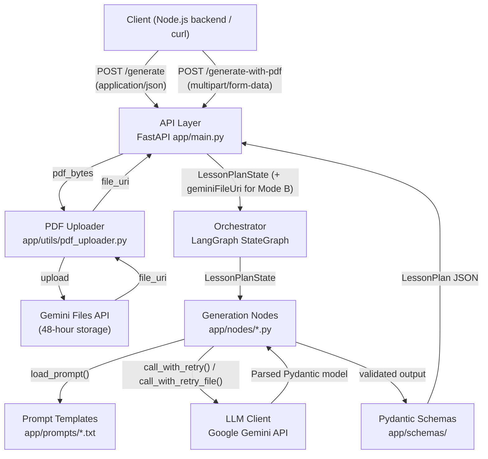
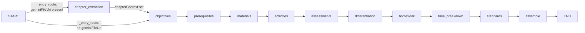
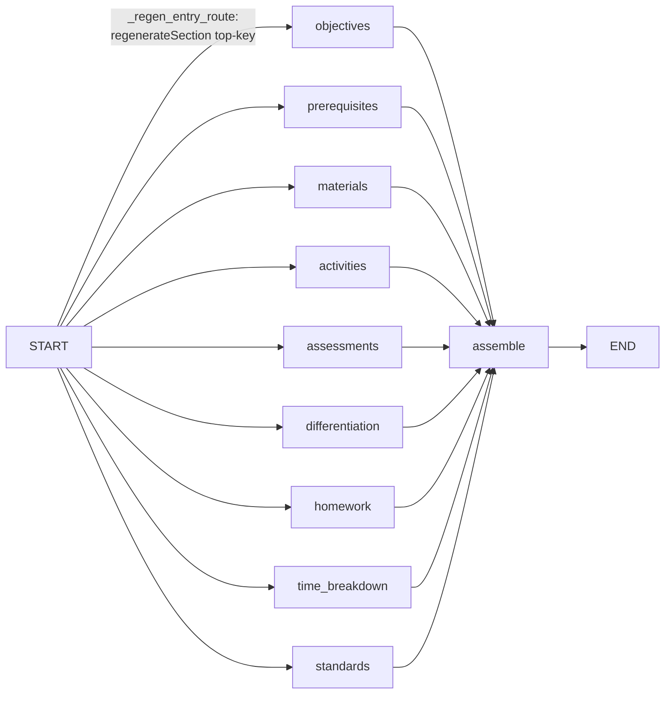

# AI Lesson Planner — Architecture

## System Context



## LangGraph Pipeline — Mode A (topic only)


## LangGraph Pipeline — Mode B (Gemini native PDF)



## Mode B — Approach 3: Gemini Native PDF

| Step | Component | Detail |
|------|-----------|--------|
| 1 | Node.js backend | Sends PDF as `multipart/form-data` to `POST /generate-with-pdf` |
| 2 | `pdf_uploader.upload_pdf_to_gemini()` | Uploads PDF bytes to Gemini Files API; returns full file URI |
| 3 | `chapter_extraction` node | Sends `[file_uri + extraction prompt]` to Gemini; reads PDF natively |
| 4 | Gemini | Understands text, tables, diagrams, and equations in the PDF |
| 5 | `chapter_extraction` node | Returns `ChapterContext` (~2000 chars) stored in state |
| 6 | All 9 generation nodes | Use `chapterContext` only — full PDF is never sent again |

**Token cost:** ~5000 tokens for chapter_extraction (once) + ~800 avg per generation node ✅

## Prompt Template Architecture

Each of the 9 generation nodes loads a single `.txt` prompt file that handles **both Mode A and Mode B** via two placeholders:

| Placeholder | Mode A value | Mode B value |
|-------------|-------------|-------------|
| `{chapter_block}` | `""` (empty string) | Structured chapter content from `ChapterContext` |
| `{grounding_instruction}` | `""` (empty string) | "Use ONLY content from chapter" instruction |

The `chapter_extraction.txt` prompt uses `{grade}`, `{subject}`, `{topic}`, `{board}` for targeted extraction but has **no** `{chapter_block}` placeholder — the PDF is sent as a Gemini file reference, not as text.

### Prompt → Node → Schema Mapping

| Prompt File | Node | Mode | Gemini Model | Output Schema |
|-------------|------|------|-------------|---------------|
| `chapter_extraction.txt` | `chapter_extraction` | B only | HEAVY | `ChapterContext` |
| `objectives.txt` | `objectives` | A + B + Regen | HEAVY | `ObjectivesOutput` |
| `prerequisites.txt` | `prerequisites` | A + B + Regen | LIGHT | `PrerequisitesOutput` |
| `materials.txt` | `materials` | A + B + Regen | LIGHT | `MaterialsOutput` |
| `activities.txt` | `activities` | A + B + Regen | HEAVY | `ActivitiesOutput` |
| `assessments.txt` | `assessments` | A + B + Regen | HEAVY | `AssessmentOutput` |
| `differentiation.txt` | `differentiation` | A + B + Regen | LIGHT | `DifferentiationOutput` |
| `homework.txt` | `homework` | A + B + Regen | LIGHT | `HomeworkOutput` |
| `time_breakdown.txt` | `time_breakdown` | A + Regen | LIGHT | `TimeBreakdownOutput` |
| `standards.txt` | `standards` | A + Regen | HEAVY | `StandardsOutput` |
| `_regen_prefix.txt` | all nodes (prepended) | Regen only | — | prefix string |

> `time_breakdown` and `standards` nodes always pass empty strings for `{chapter_block}` and `{grounding_instruction}` — chapter grounding is not applicable to timing allocation or curriculum standard generation.

## Node Implementation Details

Each generation node in `app/nodes/<name>.py` exposes a `run(state)` function. All share:
- `format_prompt(load_prompt("<name>"), **kwargs)` — safe interpolation via `app/utils/prompt_loader.py`
- `build_chapter_block(state.get("chapterContext"))` — DRY Mode A/B switching via `app/utils/chapter_context.py`
- `call_with_retry(prompt, response_schema, model)` — Gemini text call with retry
- `call_with_retry_file(prompt, file_uri, response_schema, model)` — Gemini multimodal call with retry (chapter_extraction only)

### Node Reference

| Node | Model Tier | chapter_block | Upstream context vars |
|------|-----------|--------------|----------------------|
| `chapter_extraction` | HEAVY | n/a (reads PDF directly) | geminiFileUri |
| `objectives` | HEAVY | from state | none |
| `prerequisites` | LIGHT | from state | objectives |
| `materials` | LIGHT | from state | objectives, prerequisites |
| `activities` | HEAVY | from state | objectives, prerequisites, materials, duration |
| `assessments` | HEAVY | from state | objectives, activities, **duration** |
| `differentiation` | LIGHT | from state | objectives, activities, assessment |
| `homework` | LIGHT | from state | objectives, activities, assessment, differentiation, **duration** |
| `time_breakdown` | LIGHT | **always ""** | activities, duration |
| `standards` | HEAVY | **always ""** | objectives, activities, assessment |
| `assemble` | none (pure Python) | n/a | all section outputs |

### Pipeline Entry Routing

`_entry_route(state)` in `app/graph/pipeline.py` returns `"chapter_extraction"` if `geminiFileUri` is in state, else `"objectives"`. This is a module-level function (not nested) so it can be unit-tested independently.

### time_breakdown Sum Validation

The `time_breakdown` node uses its own outer retry loop (up to `llm_max_retries + 1` attempts) separate from the inner `call_with_retry`. On sum mismatch, the prompt is augmented with the exact error. `call_with_retry` is called with `max_retries=0` inside this loop.

### Shared Utility: build_chapter_block

`app/utils/chapter_context.py → build_chapter_block(chapter_ctx)` returns `(chapter_block: str, grounding_instruction: str)`. Mode A: both empty. Mode B: structured block from `ChapterContext` + grounding rule. All 7 grounding nodes call this; `time_breakdown`, `standards`, and `chapter_extraction` skip it.

## LangGraph Pipeline — Regeneration (S3)



Star topology: START routes to exactly ONE generation node based on `regenerateSection`.
That node prepends `_regen_prefix.txt` to its base prompt.
`assemble` detects `regenerateSection` and returns a **partial dict** instead of a full `LessonPlan`.

### Regeneration State Initialisation

`run_regen_pipeline` pre-fills all 9 section outputs from `existingPlan` so the
target node has upstream context (e.g. activities node reads existing objectives):

```
regenerateSection  → "activities.guidedPractice"
existingPlan       → full LessonPlan JSON (read-only context for _regen_prefix)
objectives/prerequisites/materials/…  → copied from existingPlan into state
```

### _regen_prefix Prompt

`app/prompts/_regen_prefix.txt` is the 11th and final prompt file.
It is prepended (not substituted) to the base node prompt, instructing the LLM to:
1. Produce a DIFFERENT version from the one in existingPlan
2. Stay CONSISTENT with all unchanged sections
3. Maintain the same QUALITY standards

`build_regen_prefix(section_name, existing_plan)` in `app/utils/regen_context.py`
handles the substitution using `str.replace()` (not `format_prompt`) to avoid
double-brace corruption of the existingPlan JSON content.

## Component Boundaries

| Layer | Path | Responsibility |
|-------|------|----------------|
| API | `app/main.py` | Request validation, middleware, routing |
| Config | `app/config.py` | All settings from env vars via `Settings` |
| Schemas | `app/schemas/` | Pydantic input/output/section models |
| Graph | `app/graph/` | `LessonPlanState`, `build_graph()`, `run_pipeline()`, `run_pipeline_with_pdf()` |
| Nodes | `app/nodes/` | One file per generation step (including `chapter_extraction`) |
| Prompts | `app/prompts/` | One `.txt` file per node |
| LLM | `app/llm/` | Gemini client (`generate_structured`, `generate_structured_with_file`) + retry helpers |
| Observability | `app/observability/` | JSON structured logging, request correlation ID |
| Utils | `app/utils/` | `prompt_loader` (path traversal protection), `chapter_context` (Mode A/B switch), `pdf_uploader` (Gemini Files API) |

## State Data Flow

`LessonPlanState` (TypedDict, `app/graph/state.py`) is passed through the entire pipeline:

```
Input fields (Mode A):   grade, subject, topic, duration, board, teachingStyle, depth
Input fields (Mode B):   + geminiFileUri (Gemini file URI for the uploaded chapter PDF)

Node writes:
  chapter_extraction → chapterContext (dict — Mode B only)
  objectives         → objectives (list[str])
  prerequisites      → prerequisites (list[str])
  materials          → materials (list[str])
  activities         → activities (dict)
  assessments        → assessment (dict)
  differentiation    → differentiation (dict)
  homework           → homework (str)
  time_breakdown     → timeBreakdown (dict)
  standards          → standards (list[str])
  assemble           → _final (LessonPlan)
```
